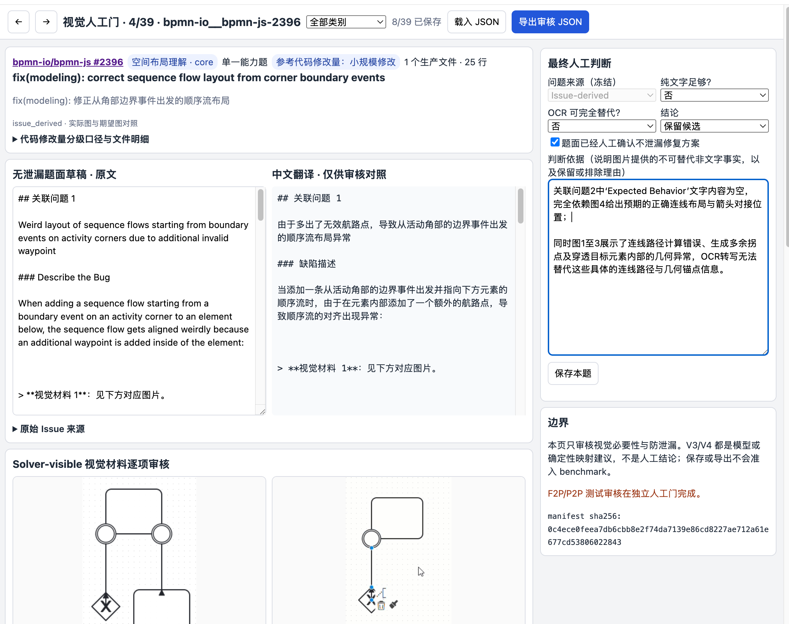
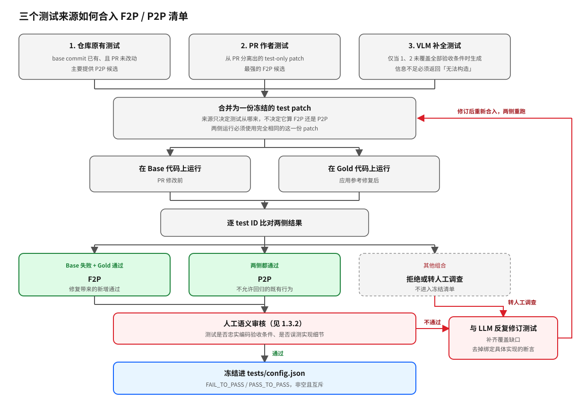
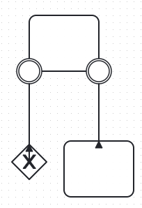
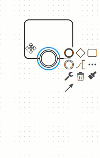
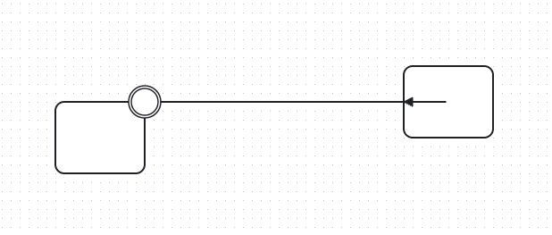
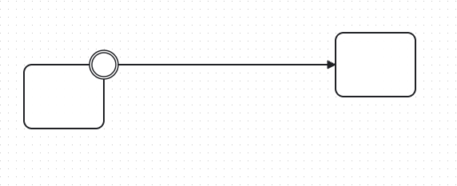
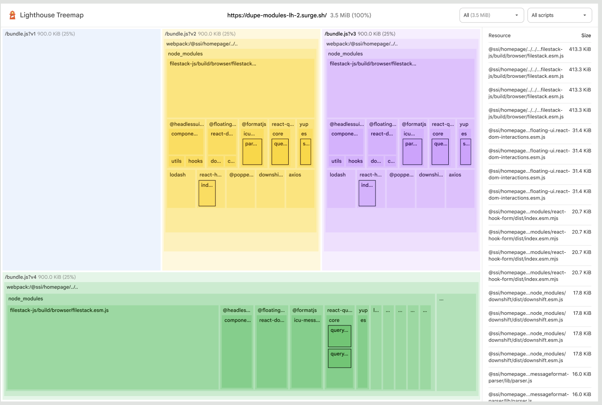
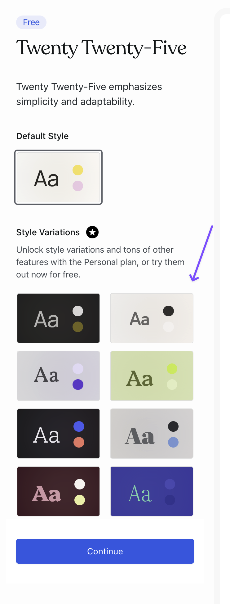
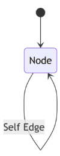
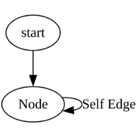

# SWE-bench Multimodal 造题方案与 Harbor 接入

## 1 造题方案

对iid 和 ood 题目来说，实际都使用同一套造题方案。
1.1–1.5 从 IID 题目构建角度描述这套共同流程；1.6 说明 OOD 在哪两个维度上与 IID 区分开，并如何
在分布偏移后保持可验证；1.7 说明这样造出来的题为什么有区分度。

### 1.1 选题来源

选择从真实 GitHub 前端仓库中捞取真实合并进默认分支的 PR以此来构建题目。
对于IID题目，我们选择了跟SWE-bench Multimodal中提及的16个前端JS Github repo。

采集的时候，参考了SWE-bench Multimodal 的做法，从github中收集数据的时候，
主要记录了PR信息，以及关联的Issue，timeline、
commit、diff/patch、changed files，以及原始视觉资产（截图、GIF、视频）等信息。

### 1.2 筛选策略
我们的筛选目的其实是想把一些需要多模态能力才能完成的题目筛选出来。

下表展示了整体的筛选策略，包含了一些规则化的筛选方法，使用VLM进行筛选以及最终用人工审核来筛选。

| 阶段 | 筛选策略 | 阶段剩余 |
|---|---|---:|
| 1. 基础 PR 池 | 收集16个repo的全部 PR，根据创建时间筛选 | 158,589 → 24,639 |
| 2. 包含视觉信息的候选召回 | 要求 PR最终是合入默认主分支的PR；优先召回关联 Issue 中有媒体的任务，Issue 不足时检查 PR 中的 before-only 证据；针对稀缺能力补充召回 | 选取 210 个不同 PR 深度处理 |
| 3. 视觉内容输入构造 | 筛选issue和pr中包含出错时视觉错误图和修复前设计稿 | 104 个处理完成；另有 91 个不合格，其余失败丢弃 |
| 4. VLM 多模态筛选 | 判断图片是否可被文字/OCR 替代、是否确实影响修复，并进行视觉能力分类；合并不同分类版本并按 PR 去重 | 39 个视觉候选 |
| 5. 人工视觉准入 | 人工确认视觉必要性、防泄漏、图片角色及题面绑定；该判断与 F2P/P2P 测试审核彼此独立 | 39 个候选进入统一审核页；本提交从中选取 6 道 IID 题 |

各阶段细则如下。

#### 阶段 1 · 基础 PR 池

收集了SWE-bench Multimodal中提及的16个前端JS Github repo了目标仓库所有 PR。
为了让确保与 SWE-bench Multimodal中的题目不重合，要求PR创建时间在2025-01-01 之后。

同时要求候选 PR 已经真实合入仓库默认分支；仍处于 open 状态、直接 closed 但没有 merge，以及合入非默认分支的 PR 不进入候选池。

最终得到，24,639 条PR。

#### 阶段 2 · 包含视觉信息的候选召回

优先从 PR 关联的 Issue 正文和 Issue 讨论区中寻找图片、GIF 或视频。
Issue 是问题提出阶段的原始材料，通常更接近用户看到的修复前现象，也更少包含具体代码方案。因此，Issue-derived 是默认优先路径。

如果 Issue 中没有合格视觉证据，再检查 PR 是有包含视觉内容。PR-derived 回退可以找回 Issue 无图、但 PR 中确有合法 before-only 截图的任务。但是可能需要对PR中的视觉内容进行分类来进一步筛选，这个放到了下一阶段。

得到210 个不同 PR 进入后续处理

#### 阶段 3 · 视觉内容输入构造

全量收集 PR 相关 Issue、评论内容、Commit、Diff、所有视觉内容文件等。

对于抽取的视觉内容（尤其是PR中的图片），调用VLM来判断视觉材料属于：修复前时的设计稿，修复前截图，还是修复后的截图。把只包含修复后截图的题目删除了，因为给出错误图或者设计图更加符合用户报错时的真实提问形式。

该判断使用独立的图片角色与泄漏 Verifier：system prompt 见
[`08_04_pr_image_role_leakage.system.md`](code/analysis/prompts/08_04_pr_image_role_leakage.system.md)，
输出 schema 见
[`08_05_pr_image_role_leakage.schema.json`](code/analysis/prompts/08_05_pr_image_role_leakage.schema.json)，
调用与留痕实现见
[`pr_image_roles.py`](code/report_pipeline/pr_image_roles.py)。

筛选了104个PR进行后续处理

#### 阶段 4 · VLM 多模态筛选

“题目中包含图片”并不意味着它真正需要视觉理解。例如，报错截图和代码截图虽然以图片形式出现，但其中的有效信息往往可以通过 OCR 完整转换成文字；如果模型不看原图也能获得全部修复条件，这类任务本质上仍然是文本题。因此，这里调用了VLM给图片进行了分类，这里还是调用Gemini，然后对图片进行八类分类：代码片段截图，网页界面（UI/UX），地图/地理空间可视化，图表或结构图，数据可视化/绘图，艺术作品/摄影，报错信息和其他。如果报错信息中可以用ocr转换文字来代替，就会把这些题目剔除。

同时，Verifier 还会判断图片是否与当前 bug 相关，分类为 unrelated 的图片同样剔除。完成这两步后，再对剩余图片检查其时间角色、OCR 可替代性和视觉必要性；只有相关、无泄漏并且包含不可由文字替代信息的修复前或期望图片才继续保留。

八类内容、相关性、OCR 可替代性与视觉贡献的初筛使用
[`08_01_visual_context_screening.system.md`](code/analysis/prompts/08_01_visual_context_screening.system.md)、
[`08_02_visual_context_screening.schema.json`](code/analysis/prompts/08_02_visual_context_screening.schema.json)
和调用脚本
[`step_08_03_pilot_visual_context_vlm.py`](code/analysis/scripts/step_08_03_pilot_visual_context_vlm.py)。
统一视觉必要性复核使用
[`09_01_visual_verifier.system.md`](code/analysis/prompts/09_01_visual_verifier.system.md)、
[`09_02_visual_verifier.schema.json`](code/analysis/prompts/09_02_visual_verifier.schema.json)
和 runner
[`step_09_03_run_visual_verifiers.py`](code/analysis/scripts/step_09_03_run_visual_verifiers.py)。

最后得到了39个候选题目

#### 阶段 5 · 人工视觉准入

前四个阶段只能产生候选，不能直接证明题目必须依赖视觉输入。第五阶段使用统一审核页逐题完成
**视觉必要性**与**防泄漏**检查。页面动态读取 39 条候选及其来源绑定，每次只展示一道题，并提供：

- PR 与关联 Issue 的原网页链接、无泄漏英文题面及仅供审核参考的中文翻译；
- 视觉能力标签、生产代码修改量分级，以及原始视觉材料；
- 每张图片的时间角色（`before_only`、`after_only`、`before_after_composite`、
  `expected_design`、`temporal_sequence` 或 `unclear`）；
- 图片是否允许交给 agent、是否包含修复后结果或解法证据、是否必须裁剪；
- “纯文字是否足够”“OCR 是否可以完全替代”“题面是否泄漏”和最终保留/排除理由。

审核不要求填写审核人。每次保存都会重新校验候选、来源 manifest 与图片哈希，并原子写入本地状态目录；
也可以导出完整审核 JSON。VLM 的分类和必要性说明只作为校准建议，不能自动替代人工结论。

视觉审核与 F2P/P2P 语义审核彼此独立。这里保留一道题，只表示其 solver-visible 图片安全且提供了
文字/OCR 无法替代的信息；它仍需经过 Base/Gold 实测和独立测试审核，才可能成为正式实例。已保存为
`keep` 的候选可以从页面触发测试覆盖 Verifier，但该动作不会反向改变视觉审核结论。

启动动态审核服务：

```bash
python3 run.py serve-visual-review --config visualizations/visual_review/server_config.json --state-root .runtime/visual_review/state --host 127.0.0.1 --port 8765
```

浏览器访问：[http://127.0.0.1:8765/visualizations/visual_review/](http://127.0.0.1:8765/visualizations/visual_review/)
。页面实现见
[`visual_review_server.py`](code/report_pipeline/visual_review_server.py)，随提交保存的 39 题审核数据与静态页面位于
[`visualizations/visual_review/`](visualizations/visual_review/)。




#### 五个阶段对应的代码入口

```bash
python3 run.py build-pr-pool
python3 run.py recall-visual-candidates
python3 run.py construct-solver-inputs
python3 run.py screen-multimodal-candidates
python3 run.py review-visual-gate
```

一些细节：
1. 会尽量的避免一个PR在修复之后，引发了一些其他Issue，导致需要继续开PR去修复。 这种只能看有没有额外的PR link了之前PR或者对应的issue。按道理这种PR的学习价值会更高，但是同时需要多模态输入的题目就很少
2. 会筛选掉一些link了10个issue以上的PR。 因为有发现有PR link了50个Issue。


### 1.3 Judge 设计原则

Judge主要评估的是两个维度，第一是对于原本功能没有影响对应着P2P测试，第二是新的功能加入之后原本失败的测试变成功了，对应着F2P测试。

重要的是我们应该如何快速的从收集的PR和issue中获得这些judge。

Judge或者说测试文件，可以有三种渠道获得：

| 层次 | 测试来源 | 主要作用 | 使用方式 |
| --- | --- | --- | --- |
| 1. 仓库原有测试 | base commit 中已经存在、且未由目标 PR 新增的测试 | 保护相邻功能和既有行为，主要提供 P2P 候选 | 从受影响组件附近的稳定测试和必要 smoke test 中选择，避免无差别运行整个仓库掩盖目标信号 |
| 2. PR 作者测试 | 目标 PR 新增或修改的测试文件 | 捕获作者对 bug 修复的显式验收意图，通常是最强的 F2P 候选 | 从 PR 中分离 test-only patch，与生产修复分开应用；测试来源不预先决定 F2P/P2P |
| 3. VLM 补全测试 | 当前两层没有直接覆盖全部验收条件时，由 VLM 去根据test patch生成对应的test bundle | 补齐视觉约束和相邻回归行为的可执行覆盖 | 只补确定的覆盖缺口，生成后仍需人工语义审核和 Base/Gold 实测 |

三个来源最终要合成同一份清单。合入的关键是**来源只决定测试从哪来，不决定它算 F2P 还是
P2P**——类别一律由同一份测试在 Base 与 Gold 两侧的真实运行结果判定：




讨论：可能可以引入model-based的verifier进行评估。
但是可能需要单独去讨论VLM对于具体的场景能不能给出稳定的评分。
如果带有参考图的话，可以通过对比参考图来给出一些pairwise的打分，这样可能会更准。
而对于不同题目，所需要的模型的多模态能力也是不太一样的，需要对不同场景进行测试，在这次笔试题并没有尝试该方案。
而是尝试把一些具体的视觉现象转换成具体的可计算的代码来计算。

#### 1.3.1 如何约束 VLM 合理补全测试

VLM 不能直接根据 PR 自由编写测试。调用模型前，流程程序会先将仓库切换到目标 PR 修改前的Base commit，并整理一份固定的测试上下文。其中包括：

- 不包含修复方案的题目描述；
- 经过人工确认、最终可以提供给解题模型的图片；
- 从题目和图片中提取的功能要求；
- PR 修改的文件和参考修复；
- Base commit 中实际存在的测试框架、配置、辅助函数和相邻测试。

参考修复只用于帮助 VLM 理解需要验证的功能，不能直接作为测试答案。
并且要专门在System Prompt中强调实现的代码不一定要求解题模型采用相同的函数、常量、文件组织或代码写法才算正确。

我们在System Prompt中专门指导模型如何一步一步推导是否需要补充测试，以及如何补充测试：

1. 先说明“什么样的结果才算修复正确”。

   对每一项功能要求，VLM 都必须说明：

   - 正确修复后，用户能够观察到什么结果；
   - 哪些原有功能必须保持不变；
   - 可以通过什么公开结果进行检查，例如元素状态、几何位置、计算样式、渲染结果或完整交互过程。

   这一步只定义功能行为，不编写测试代码。它的作用是防止模型直接照着参考修复的代码结构写断言。

2. 再判断是否需要补充测试。

   VLM 会检查仓库原有测试和 PR 作者提交的测试代码，判断它们是否已经覆盖前面定义的功能行为。
   只有确实存在覆盖缺口，才允许生成新的测试包。

   新测试必须提供完整代码、实际可用的运行命令和唯一的测试名称。
   如果现有信息不足以写出可靠、可执行的测试，VLM 必须明确返回“信息不足”或“无法构造可靠测试”，不能凭空生成代码。

生成的测试还必须说明：

- 每条断言验证了题目中的哪项功能；
- 采用不同代码实现的正确修复为什么也能通过；
- 只修复表面现象或修复不完整时为什么会失败；
- 测试为什么能够被仓库现有的测试工具实际发现并执行。

VLM 生成的测试只是候选，不能直接认定为 F2P 或 P2P。流程程序会把完全相同的测试分别运行在：

- 修改前的 Base 代码；
- 应用参考修复后的 Gold 代码。

只有 Base 失败、Gold 通过的测试才能归入 F2P；Base 和 Gold 都通过的测试才能归入 P2P。

我们对比了GPT5.6-Luna-Max，Kimi K3 和 Gemini 3.7 Flash三种模型生成test的表现，发现
Gemini 3.7 Flash 生成速度快、并发稳定，但容易产生表面合理、实际无法通过 Gold 验证的测试，所以暂时淘汰了。Kimi K3 表现出更完整的约束分析和功能测试意识，但是目前使用api调用太慢了。GPT-5.6 Luna Max 最善于识别上下文不足，并倾向于构造面向功能行为的 oracle，并且调用速度较快，因此目前作为主要的test生成器。

当前可执行测试构造所用 system prompt、schema 与批量 runner 分别为
[测试构造 system prompt](code/analysis/prompts/20_17_v4_test_constructor.system.md)、
[测试构造输出 schema](code/analysis/prompts/20_18_v4_test_constructor.schema.json)
和
[批量测试构造 runner](code/report_pipeline/v4_test_campaign.py)；Base/Gold 实测与类别判定由
[测试测量 runner](code/report_pipeline/v4_test_measurement.py)完成，不由 VLM 预测写入。

#### 1.3.2 Judge 人工语义校准

Base/Gold 实测完成后，再对最终纳入的 F2P/P2P 做人工语义校准。

主要是防止生成的一些测试实际上并不能很好的覆盖测试的维度和过度测试，固定到某种特定的代码实现方式来评估准确性。

这一阶段主要是人类需要跟LLM反复的沟通和确认完成的。

目前的流程基本是让codex luna去走一遍具体的解题，然后看解题方案是否有不同的做法，
以此来反推Judge是否有潜在的问题，并以此进一步抽象化测试方案让他可以适配不同的实现方式的评估。

### 1.4 难度控制

难度控制可以映射为三个因素：

- 参考修复的代码行数；
- 参考修复是否跨越多个文件，以及需要满足多少项功能要求；
- 完成该代码修正所需要的人类专家时间。

但是对于最后一项代码修正的时间是不太好获取的。虽然可以将PR里面的打开到完成的时间间隔可以作为一种人类专家完成该修复需要的时间都体现，但是并不是非常精准，所以这里我们更多直接用前两项来做第一种难度的分类。

统计时只计算参与功能实现的生产源代码。测试、测试快照、依赖锁文件、图片、生成文件和构建产物不计入修改规模。

| 规模 | 判定条件 |
| --- | --- |
| 小规模修改 | 修改 1 个生产源文件，新增和删除合计不超过 100 行 |
| 中规模修改 | 修改 2 至 4 个生产源文件，新增和删除合计不超过 100 行 |
| 大规模修改 | 修改至少 5 个生产源文件，或者新增和删除合计超过 100 行 |
| 待复核 | 排除无关文件后，没有识别出生产源代码修改 |

同时，考虑第二种分类是完成修复所需要的一些多模态理解能力。
解题模型必须从图片或视频中理解什么信息，才能确定正确的修复要求。
不同的视觉能力要求也可以视作是一种难度要求。

| 视觉能力 | 典型内容 |
| --- | --- |
| 渲染外观理解 | 颜色、字体、透明度、边框、阴影、渐变、纹理和其他表面效果 |
| 空间布局理解 | 位置、距离、尺寸、对齐、遮挡、重叠、旋转、连线路径和相对几何关系 |
| 元素与状态理解 | 元素是否存在、数量、顺序、层级，以及选中、禁用、展开、错误或加载等状态 |
| 交互与时序理解 | 点击、拖动、悬停、缩放、动画、跳转和状态变化等连续过程 |
| 多能力组合 | 需要的能力是上述能力的组合 |

这里主要也是调用VLM（Gemini3.7Flash）对这些题目进行分类。

视觉能力多标签分类使用
[视觉能力分类 system prompt](code/analysis/prompts/20_09_visual_capability_classifier_v4.system.md)、
[视觉能力分类输出 schema](code/analysis/prompts/20_10_visual_capability_classifier_v4.schema.json)
和批量入口
[`pre_review_classification.py`](code/report_pipeline/pre_review_classification.py)。该分类只决定覆盖度标签，
不替代视觉必要性或防泄漏判断。

#### 1.4.1 候选池在两个难度轴上的覆盖

人工筛选时候选池共 **39 个不同 PR，横跨 14 个 JavaScript/TypeScript 前端仓库**，其中 8 条同时命中多项
视觉能力。

视觉能力轴上，四项均达到至少 5 个不同 PR 的覆盖目标：

| 视觉能力 | 命中候选数 |
| --- | ---: |
| 渲染外观理解 | 16 |
| 空间布局理解 | 20 |
| 元素与状态理解 | 8 |
| 交互与时序理解 | 5 |

修改规模轴上，三档都有足够存量可供分层取题：

| 修改规模 | 候选数 |
| --- | ---: |
| 小规模修改 | 18 |
| 中规模修改 | 11 |
| 大规模修改 | 10 |

规模标签由 `change_scale` 记录，逐候选保留清洗后的生产文件清单、被排除的文件及排除理由，可以
复核到单个文件，不是人工估计。

**这 39 条是召回与自动分类的产出，入选正式题还要过人工核实。** 本次从池中人工核实并选出 6 道
IID 题，逐题的视觉能力与修改规模见第 2.1 节总览表。候选统计不能替代正式实例：入选题的测试、
Oracle 和 Harbor 证据随每题写在第 2 节的卡片里。

统一审核页的 `metadata.json` 绑定 39 条候选、视觉能力标签与来源 manifest，上面两张表都可以由
其中的候选记录重新计算：
[`visualizations/visual_review/metadata.json`](visualizations/visual_review/metadata.json)。完整过程归档不随提交。


### 1.5 多模态必要性校验

我们采用了多种方式来保证题目中的多模态输入必要性。先用规则筛出 Issue 或 PR 中确实
带视觉内容的候选，再由 VLM 判断这些视觉内容是不是修复前的设计稿或错误现象，并剔除那些报错截图能被
OCR 完整转成文字、看不看图都一样的题，最后由人工逐题确认。每一步的取值、模型与逐阶段剩余量见
第 1.2 节的筛选策略。

需要单独强调的是，**视觉必要性审核与 F2P/P2P 语义审核是两条独立的校准轴，都必须通过**：前者只问
像素是否提供了超出文字与 OCR 的、与修复相关的信息以及是否泄漏答案，不涉及任何 F2P/P2P 字段；后者
只问测试是否忠实编码验收条件，不重复判断视觉必要性。

审核页的判定规则、留痕方式与所用 Verifier 见
[附录 B.6](docs/pipeline_internals.md#b6-多模态必要性与防泄漏审核的实现render--unify--audit-visual-gate-review)。

### 1.6 OOD构建方案

OOD 与 IID 共用 1.1–1.5 的全套流程。两者使用相同的 PR 时间条件、视觉证据规则、测试合同、
Base/Gold 实测和 Harbor controls；区别只在候选仓库池代表的分布。第 1.4 节的视觉能力分类继续用于
检查题集覆盖度，但它本身不是 OOD 维度。

OOD 题目主要沿两个互斥维度创建：

1. **同语言、跨仓库**：从 IID 来源集合之外的前端 JS/TS 仓库收集，保持语言和 UI repair 类型尽量
   不变，只引入 repo shift。项目已静态核验的首批候选为 `bytedance/flowgram.ai`、
   `readest/readest`、`dyad-sh/dyad`、`simstudioai/sim`、`DayuanJiang/next-ai-draw-io` 和
   `onlook-dev/onlook`。补充池还包括 OpenCut、RapidRAW、coss、GitDiagram、stagewise、Twenty 和
   assistant-ui。
2. **跨语言或渲染栈**：保持“视觉证据驱动的软件修复”任务合同不变，但将生产代码改为 Python、
   Rust、Go、C#/XAML 或 Dart。已核验的候选为 Matplotlib、WeasyPrint、Typst、Fyne、Avalonia 和
   Flutter；归类依据是目标 PR 实际修改的生产代码语言，而不是仓库主要语言。

候选仓库当时按以下顺序筛选：首先排除与 SWE-bench Multimodal 来源仓同名的仓库；再优先选择
2024-10-04 后创建、或主要开发活动发生在该日期之后的项目；随后检查其公开 Issue/PR 规模、视觉
repair 场景、媒体证据密度、lockfile 与测试入口；最后评估是否能把外部 API、数据库、字体、WASM、
浏览器或原生运行时固定进离线 Harbor 环境。仓库通过这一步只表示“值得爬取”，逐 PR 仍必须重新走
Issue-first 召回、视觉必要性与防泄漏、F2P/P2P 实测、empty=0、gold=1 和稳定性校验。

目前只是完成的是上述仓库级静态调研，尚未把这些候选表述为已通过准入的 OOD 实例。
各仓库的视觉任务形态、测试基础、环境风险和完整筛选边界见[OOD 候选仓库静态核验摘要](evidence/ood_repository_candidates.md)。

### 1.7 区分度与模型 / RL 价值

区分度不靠题面写得难懂，而靠第 1.4 节那两个受控的轴——**修改规模**与**所需视觉能力**——把题目摊在
一个可以排序的平面上。两个轴制造的难度不是一回事：

- **修改规模决定模型需要多大的视角。** 小规模题只要在一个文件里定位一处改动；大规模题跨多个文件、
  同时要满足多项功能要求，模型得先对模块结构形成整体判断再动手，局部试错改不出来。
- **视觉能力之间存在偏序。** 多能力组合题不可能只靠单一能力过关——`googlechrome__lighthouse-16403`
  同时要求渲染外观、空间布局和元素与状态三项，模型必须在每个单维度上都达标，组合题才会通过。反过来，
  如果模型在单维度题上就稳定失败，那么它在组合题上的零分应归因于感知而不是代码。

这两条合起来的用处是题集本身可以做课程学习。按修改规模从小到大、按视觉能力从单维度到多能力组合，
题集就是一条从易到难的路径，RL 训练可以据此做课程学习，而不是把难度不一的题混进同一个批次——让
一个还读不准色板对比度的模型直接去改 258 行的自环几何，学到的只是噪声。

另一半价值在于**奖励信号指向的是功能而不是 gold patch的一比一实现**。judge 判的是 Issue 要求的行为是否达成：
F2P 提供稀疏但确定的成功信号，P2P 拦住删功能、硬编码、改测试这类破坏性捷径；gold 的私有 class、
DOM 层级、函数名、常量和文件组织都不是正确性定义，结构不同但语义等价的实现必须同样得到 reward=1，
这一条由 oracle 质量记录里的等价实现反例强制（见
[附录 C.3.5](docs/layout_and_trust.md#c35-正式测量与-oracle-质量)）。奖励因此不奖励对 gold patch的细节拟合。

最后，失败要能归因。纯文字 / VLM 对照实验加上两道彼此独立的人工审核，让训练分析能区分三种零奖励：

| 零奖励的成因 | 由什么区分出来 | 对训练的含义 |
| --- | --- | --- |
| 视觉理解失败 | 纯文字 Verifier 判定"文字不充分" + 多模态审核确认图片不可替代 | 感知能力的训练信号 |
| 代码修复失败 | 视觉约束已提取但补丁未使 F2P 通过 | 定位与修复能力的训练信号 |
| Judge 错误 | F2P/P2P 语义审核未通过，或测试误测实现细节 | 应从训练数据中剔除，而非当作模型失败 |

不做这个区分，所有 reward=0 会被当成同一种学习信号，其中还混着 judge 自己的错误，直接污染梯度方向。

---

## 2 iid 实例题：判分、验证与图片不可替代性

### 2.1 题集总览

本轮固定验证六道跨仓库 IID 候选。下表只报告题目和已经执行得到的
测试证据，不在此处声明人工审核或正式晋升状态；Oracle 与负向控制结果逐题记在各自卡片。

| instance_id | 题目摘要 | 视觉能力 | 参考修改规模 | Judge数目 |
| --- | --- | --- | --- | --- |
| `bpmn-io__bpmn-js-2396` | 修复边界事件顺序流的多余航点和错误方向 | 空间布局理解 | 小规模（1 文件） | 2 F2P、72 P2P |
| `googlechrome__lighthouse-16403` | 按目标稿更新 Treemap 的布局、颜色和文字 | 多能力组合（渲染外观 + 空间布局 + 元素与状态） | 中规模（3 文件） | 5 F2P、3 P2P |
| `automattic__wp-calypso-100957` | 提高主题样式变体色板的视觉对比度 | 渲染外观理解 | 小规模（1 文件） | 2 F2P、2 P2P |
| `automattic__wp-calypso-99049` | 统一 Domain Forwarding 中 Add Forward 的链接色 | 渲染外观理解 | 中规模（3 文件） | 1 F2P、2 P2P |
| `mermaid-js__mermaid-7711` | 将状态图自环渲染为位于节点侧边、无尖锐折返的单条路径 | 空间布局理解 | 大规模（1 文件、258 行） | 1 F2P、17 P2P |
| `excalidraw__excalidraw-9002` | 字号变化后同步重算绑定折线箭头的几何路径 | 空间布局理解 | 小规模（1 文件） | 1 F2P、1 P2P |

### 2.2 Pass@1 / Pass@5 的总分标

逐题的成功次数与失败归因写在各自卡片的“Pass@1 分析”和“Pass@5 与失败分析”里，这里只说明计数
规则。基础设施失败、verifier `invalid` 或未进入 Agent/Verifier 的 trial 不计入有效次数，也不
包装成模型失败。一次 Pass@5 只要五条有效 trial 中至少一条 `reward=1` 即记为通过；成功次数仍
保留五次中实际成功的条数，用于观察稳定性。

Pass@5 目前只对 GPT-5.6 Luna Max 逐题执行。Kimi K3 有三题产生了有效的 Pass@1 结果、其余三题为
基础设施无效，但受 API 调用速度限制还没有产生有效的 Pass@5 trial，因此各卡片不报告它的 Pass@5。

| 模型 | Pass@1 运行过的题 / 成功 | Pass@5 有效 / 成功 |  Pass@5 |
| --- | ---: | ---: | --- |
| GPT-5.6 Luna Max | `6 / 4` | `27 / 18` | 66.7% |
| Kimi K3 | `3 / 2` | `0 / 0` | - |

### 2.3 `bpmn-io__bpmn-js-2396`

题目要求修复从活动角部 boundary event 出发的 sequence flow。输入图片分别展示多出的无效 waypoint、
由此形成的异常折线路径，以及横向连接时箭头停靠方向错误的实际/期望对照。文字能描述“多余航点”
和“方向错误”，但不能完整表达边应如何接触节点、在哪一侧停靠和路径应保持怎样的几何关系。

<table>
  <tr>
    <td width="50%"><br><sub>Issue 1：角部 boundary event 连下方元素时多出的无效 waypoint</sub></td>
    <td width="50%"><br><sub>Issue 1：复现步骤录屏</sub></td>
  </tr>
  <tr>
    <td width="50%"><br><sub>Issue 2：横向同轴连接时箭头停靠方向错误（实际）</sub></td>
    <td width="50%"><br><sub>Issue 2：期望的连接方向</sub></td>
  </tr>
</table>

- **视觉能力 / 修改规模：** 空间布局理解；小规模修改（1 个生产源文件）。
- **题面来源：** Issue-derived。
- **图片提供的信息：** 角部 boundary event 的多余 waypoint、折线路径、节点接触侧和箭头停靠方向。动图表示来具体是如何触发该错误的
- **为何不可替代：** 文字能说“多余”或“方向错误”，但不能完整编码正确路径的空间关系。
- **对应 F2P：** PR 作者的两条 `boundary events / non-loops` 测试，分别验证纵向和横向同轴连接应为无额外 waypoint 的直线。
- **P2P 防止的捷径：** 72 条既有测试保护 loop、gateway、subprocess、横纵布局及 reconnect/move 后的修复行为。

Judge修正：
当前 Harbor 输入只保留作者/仓库测试，实测得到 2 条 F2P 和 72 条 P2P。VLM判断不需要添加新的测试文件。


**Judge。** 判分的通用原则见第 1.3 节，`config.json` 字段与 `test.sh` 判分链路见
[附录 C.3](docs/layout_and_trust.md#c3-判分链路与-oracle-质量控制)；本题的取值是：

| 项 | 本题取值 |
| --- | --- |
| 测试命令 | `python3 /tests/sweb_grade.py` 驱动 `sweb_runner.cjs`，复用仓库自己的 `test/config/karma.unit.js`，在 headless Chrome 里跑 Karma + Mocha |
| log parser | `sweb_grade.functional_json_v1` |
| base commit | `686561a9b9c733dc3a466a26e3803c5832b3c956` |
| F2P（2） | 角部 boundary event 的纵向、横向同轴连线各一条：应为无多余 waypoint 的直线 |
| P2P（72） | loop、gateway、subprocess、横纵布局，以及 reconnect / move 之后的既有连线行为 |

逐条测试的完整 ID、来源、F2P/P2P 实测类别及中英文功能目的见[测试审计页](cases/bpmn-io__bpmn-js-2396/outputs/08_audit/index.html)。

**Oracle 双验证。** 同一份 judge 跑四道控制，空 patch 与 gold 是其中的两道：

| 控制 | 操作 | 期望 reward | 实测 reward | 结果文件 |
| --- | --- | ---: | ---: | --- |
| gold | 应用 `solution/solve.sh` 的 gold patch | `1.0` | `1.0` | [`result.json`](cases/bpmn-io__bpmn-js-2396/outputs/05_controls/05_20_codex_ready_gold_oracle/task__ECG5m5t/result.json) |
| empty | 不修改任何生产代码 | `0.0` | `0.0` | [`result.json`](cases/bpmn-io__bpmn-js-2396/outputs/05_controls/05_21_codex_ready_empty_patch/task__AP7s8Ya/result.json) |
| nop | Agent 空转、不产出补丁 | `0.0` | `0.0` | [`result.json`](cases/bpmn-io__bpmn-js-2396/outputs/05_controls/05_22_codex_ready_nop/task__5vfsrLn/result.json) |
| empty-no-reply | Agent 无回复即结束 | `0.0` | `0.0` | [`result.json`](cases/bpmn-io__bpmn-js-2396/outputs/05_controls/05_23_codex_ready_empty_reply/task__fW6SSWY/result.json) |

**Pass@1 分析。** GPT-5.6 Luna Max 与 Kimi K3 的单次作答都通过 2 条 F2P 和 72 条 P2P，
Pass@1 均为 `1`。这两次是模型在本题上的有效作答结果，不因后续只修改 verifier 封装而降级；
证据分别见 Codex [测试结果](cases/bpmn-io__bpmn-js-2396/outputs/10_pass1/codex-luna-max/bpmn-io__bpmn-js-2396-codex-luna-max-pass1/0a47094ba8eeb0534c2bc3caa3af8169__AtgAPdw/verifier/test_results.json)
与 K3 [测试结果](cases/bpmn-io__bpmn-js-2396/outputs/10_pass1/kimi-k3/bpmn-io__bpmn-js-2396-kimi-k3-pass1/0a47094ba8eeb0534c2bc3caa3af8169__GoenEWE/verifier/test_results.json)。

**Pass@5 与失败分析。** 五次运行均完整通过 2 条 F2P 与 72 条 P2P，结果为 `5/5`、Pass@5=`1`。每次回放还向 `/testbed/test` 加入agent 测试标记，证明这些变化不会再进入 judge。

运行入口：

```bash
# 1. Oracle：应用 gold solution 后执行测试；该题应得到 reward=1。
harbor run -p cases/bpmn-io__bpmn-js-2396 -a oracle -k 1 -n 1 -o cases/bpmn-io__bpmn-js-2396/outputs/06_oracle -y
# 2. Kimi K3 Pass@5：执行五次独立 trial，最多并发两个 K3 请求。
harbor run -c cases/bpmn-io__bpmn-js-2396/outputs/06_freeze/kimi-k3/01_harbor_job.json -p cases/bpmn-io__bpmn-js-2396 -k 5 -n 2 --n-concurrent-agents 2 -o cases/bpmn-io__bpmn-js-2396/outputs/07_pass5/kimi-k3 -y
# 3. Codex Luna Max Pass@5：执行五次独立 trial，并发五个 Agent。
harbor run -c cases/bpmn-io__bpmn-js-2396/outputs/06_freeze/codex-luna-max/01_harbor_job.json -p cases/bpmn-io__bpmn-js-2396 -k 5 -n 5 --n-concurrent-agents 5 -o cases/bpmn-io__bpmn-js-2396/outputs/07_pass5/codex-luna-max -y
```

### 2.4 `googlechrome__lighthouse-16403`

题目要求把 Lighthouse Treemap 更新到 Issue 给出的新设计。目标图同时限定右侧 Resource/Size 列表、
Treemap 与列表的左右分栏、bundle 内不同深度的同主题色变化，以及 caption 的层级和文字呈现。
这些空间、颜色和结构约束共同构成目标，单独保留“Issue 要求更新设计”无法唯一确定实现。



*Issue 给出的目标设计稿：左右分栏、bundle 色系、caption 层级与 Logo 尺寸。*

- **视觉能力 / 修改规模：** 多能力组合，渲染外观、空间布局与元素状态三项均为核心；中规模修改（3 个生产源文件）。
- **题面来源：** Issue-derived，使用修复前已存在的期望设计图。
- **图片提供的信息：** 给出的是设计图。Treemap/资源列表的左右分栏、标题和 caption 层级、Logo 尺寸，以及 bundle 色系与后代节点的明暗关系。
- **为何不可替代：** “图片展现了具体的设计，文字描述没有给出布局、颜色和文字层级的可执行约束。
- **对应 F2P：** `LHM-16403-TITLE-VISUAL`、`LHM-16403-CAPTION-CONTENT`、`LHM-16403-CAPTION-HIERARCHY`、`LHM-16403-DEPTH-COLOR`、`LHM-16403-HEADER-TOTAL`。
- **P2P 防止的捷径：** `LHM-16403-COLOR-FAMILIES` 保证顶层 bundle 仍有不同且可读的颜色，`LHM-16403-SELECTION-DETAILS` 保证选择 bundle 后仍显示名称、大小和占比，`LHM-16403-TABLE-P2P` 保证资源表没有因重画布局而丢失数据。

**Judge 的人工迭代记录。** 早期生成测试曾把私有 class 名和过弱的几何/颜色代理当成 oracle，因此被替换。
后续版本又把`16px`、固定颜色、两个子元素和 `2px margin` 等 Gold 实现常量写入断言，太过严格。
最终更改了进行Judge重写，只观察可见性、强调关系、caption 事实与视觉层级、computed color、选择行为和资源表内容；CSS 隐藏根caption 与不同 DOM 结构均可通过。该版本在 Base 与 Gold 上顺序回放两次，稳定得到 5 F2P 和
3 P2P；Gold 每次 8/8、reward=1，Base 每次 3/8、reward=0。
旧 Codex patch 回放得到 4/8、reward=0，颜色与隐藏 caption 已通过，失败只来自标题未强调、caption 无层级、总量被改写和表格
清空。完整记录见[语义重写审计](cases/googlechrome__lighthouse-16403/outputs/11_verifier_semantic_rewrite/01_summary.json)。

**Judge。** 判分的通用原则见第 1.3 节，`config.json` 字段与 `test.sh` 判分链路见
[附录 C.3](docs/layout_and_trust.md#c3-判分链路与-oracle-质量控制)；本题的取值是：

| 项 | 本题取值 |
| --- | --- |
| 测试命令 | `python3 /tests/sweb_grade.py`：先 `yarn build-treemap` 产出真实 bundle，再 `yarn mocha --testMatch <test_file>` 跑浏览器断言 |
| log parser | `lighthouse_16403.mocha_text_v1` |
| base commit | `9ab6a2f970094a9ae45280d47215e3cbce5e1937` |
| F2P（5） | 标题与 Logo 可见、有强调、不重叠<br>删掉冗余的汇总 caption，但每个 bundle 仍给出名称、体积、占比<br>bundle 名称与指标可读且有层级强调<br>后代节点与父节点明显区分但保持同色系<br>选中某个 bundle 不覆盖页头的全局字节总量 |
| P2P（3） | 顶层 bundle 各有不同计算色且文字满足对比度<br>选中 bundle 后仍给出名称、字节数与百分比<br>既有资源表继续列出全部叶节点与字节数 |

逐条测试的完整 ID、来源、F2P/P2P 实测类别及中英文功能目的见[测试审计页](cases/googlechrome__lighthouse-16403/outputs/08_audit/index.html)。

**Oracle 双验证。** 同一份 judge 跑四道控制，空 patch 与 gold 是其中的两道：

| 控制 | 操作 | 期望 reward | 实测 reward | 结果文件 |
| --- | --- | ---: | ---: | --- |
| gold | 应用 `solution/solve.sh` 的 gold patch | `1.0` | `1.0`（连续两次） | [`test_results.json`](cases/googlechrome__lighthouse-16403/outputs/11_verifier_semantic_rewrite/02_gold/test_results.json) |
| empty | 不修改任何生产代码 | `0.0` | `0.0`（连续两次） | [`test_results.json`](cases/googlechrome__lighthouse-16403/outputs/11_verifier_semantic_rewrite/03_base/test_results.json) |
| nop | Agent 空转、不产出补丁 | `0.0` | `0.0` | [`result.json`](cases/googlechrome__lighthouse-16403/outputs/15_current_pass5/controls/07_nop/f7f643a6f33eded02ad5385309003879__hrdpZo4/result.json) |
| empty-no-reply | Agent 无回复即结束 | `0.0` | `0.0` | [`result.json`](cases/googlechrome__lighthouse-16403/outputs/15_current_pass5/controls/08_empty_no_reply/f7f643a6f33eded02ad5385309003879__hfeymaC/result.json) |

**Pass@1 分析。** GPT-5.6 Luna Max 的单次作答按修正后的语义 verifier 回放仍为 `0`，但结果由旧
verifier 的笼统 0/5 细化为 4/8：颜色和隐藏 caption 已满足，标题强调、caption 层级、全局总量和
资源表仍不符合目标稿。Kimi K3 的对应运行没有形成有效模型 trial。完整回放见
[语义重写审计](cases/googlechrome__lighthouse-16403/outputs/11_verifier_semantic_rewrite/01_summary.json)。

**Pass@5 与失败分析。** GPT-5.6 Luna Max 已完成三条有效 trial，暂为 `0/3`；另两条仍在运行或排队，
因此题目 Pass@5 尚不能定论。前三个 patch 都完成了较大范围的 Treemap 重构，且资源表 P2P 均通过，
不是空补丁；共同失败集中在标题强调、全局总量保持、深度色或选中 bundle 详情中的若干项。也就是说，
模型能复现大体布局，但没有同时满足图片中的全部视觉层级和既有交互语义，这与多能力组合题的预期
难度一致。Codex 运行
[汇总](cases/googlechrome__lighthouse-16403/outputs/15_current_pass5/codex-luna-max/10_codex_pass5_01/result.json)与


运行入口：

```bash
# 1. Oracle：应用 gold solution 后执行测试；该题应得到 reward=1。
harbor run -p cases/googlechrome__lighthouse-16403 -a oracle -k 1 -n 1 -o cases/googlechrome__lighthouse-16403/outputs/06_oracle -y
# 2. Kimi K3 Pass@5：执行五次独立 trial，最多并发两个 K3 请求。
harbor run -c cases/googlechrome__lighthouse-16403/outputs/06_freeze/kimi-k3/01_harbor_job.json -p cases/googlechrome__lighthouse-16403 -k 5 -n 2 --n-concurrent-agents 2 -o cases/googlechrome__lighthouse-16403/outputs/07_pass5/kimi-k3 -y
# 3. Codex Luna Max Pass@5：执行五次独立 trial，并发五个 Agent。
harbor run -c cases/googlechrome__lighthouse-16403/outputs/06_freeze/codex-luna-max/01_harbor_job.json -p cases/googlechrome__lighthouse-16403 -k 5 -n 5 --n-concurrent-agents 5 -o cases/googlechrome__lighthouse-16403/outputs/07_pass5/codex-luna-max -y
```

### 2.5 `automattic__wp-calypso-100957`

题目发生在 WordPress.com 的主题选择与 Theme Previewer。Issue 指出若干 style variation 色板对比度
过低；截图展示了具体卡片中前景色圆点和背景色的组合，使 solver 能判断哪些视觉组合不可辨识。
测试目标是对用户可见的对比关系，而不是锁定参考补丁中的组件层级或私有 class。

Issue 的明文要求是“部分色板对比度很差，应修正未达到最低对比度的 suggested style variations”。
它没有规定阈值、颜色字段、算法或具体实现。下面的“两枚圆点仍存在”和“卡片不能整体消失”来自
截图所示既有 UI 结构及 PR 的 After/Core 对照，属于防退化约束，不冒充 Issue 原文。



*PR 截图：主题卡片右侧两枚圆点与卡片背景的对比度过低。*

- **视觉能力 / 修改规模：** 渲染外观理解；小规模修改（1 个生产源文件）。
- **题面来源：** Issue-derived。
- **图片提供的信息：** 指出了主题卡片右侧两个圆形色块与卡片背景之间实际难以辨识的现象，以及修改后应拉开的视觉对比关系。
- **为何不可替代：** 文字没有唯一指出哪些色板角色和组合造成低对比度。图片中指出了具体的样例。
- **对应 F2P：** 两条 `GlobalStylesVariationPreview visual acceptance contract` 测试，分别复现 PR 截图中的浅色和淡紫卡片，验证两个圆形色块均能与背景明显区分；同时要求仍有两个圆点，防止通过删掉不可辨识的圆点取巧。
- **P2P 防止的捷径：** 两条 P2P 保留预览背景色与标题框 heading 颜色。

**Judge 的人工迭代记录。** 该 PR 没有作者新增测试。VLM Verifier 最初参考 Gold 行为生成了三条 F2P：要求第一个色块固定取
`color.text`，第二个固定取按钮背景色或链接色，并要求重复 palette slug 不产生 React key warning。
这组测试把 Gold 的颜色来源与列表拼接策略当成了唯一答案，并没有直接判断截图中的背景与两个色块
是否已经拉开。实际被测试称为“无关”的 `#ff0000` 和 `#ee0000` 对白色分别约为 `4.00:1` 和
`4.53:1`，已经具有可辨识对比度，却仍会因为字段来源不符而失败；duplicate-key 也不是 Issue 提出
的视觉验收条件。

第一次人工改写得到的中间测试虽然已经改测最终颜色，却在看过 Codex patch 后沿用了该 patch 的 `3:1`
阈值，并额外加入了足够让其保留两个圆点的 fallback 色。因此该次 Codex `reward=1` 存在 post-hoc
偏差，只作为历史记录，不用于评价模型。

测试先从 PR 原始 Before/After/Core 截图确定观测对象，再由人工将最低对比度校准为 `2:1`：

| 检查项 | 基准与来源 |
| --- | --- |
| 核心 F2P | 最终 DOM 中两个圆点分别与所在卡片背景形成可辨识颜色差异 |
| 防退化约束 | 当前可执行测试要求保留两个圆点；“不得隐藏整张 variation 卡片”是语义要求，尚需父列表测试补强 |
| 浅色卡片观测 | Before 最低 `1.0521:1`，After 最低 `4.2554:1` |
| 淡紫卡片观测 | Before 最低 `1.1292:1`，After 最低 `4.9832:1` |
| 冻结阈值 | 人工校准为 `2:1`；该值高于两组复现的 Before，低于最弱的匹配 After `4.2554:1` |
| 实现自由度 | 不限定颜色字段、palette 排序、helper、RGB 修改方式或生产代码结构 |
| P2P | 保留原有卡片背景色与标题颜色 |

按这一验收条件得到以下模型错误分析：

| Patch | 当前测试结果 | 实际做法 | 为什么没有满足 Issue |
| --- | --- | --- | --- |
| Codex Luna | 三轮均 `reward=0`；2 F2P 失败、2 P2P 通过 | 删除卡片内部低于 `3:1` 的 palette 项 | 在两组输入中最后只剩一个圆点；它隐藏了有问题的视觉元素，而没有让两枚圆点都清晰可辨 |
| Kimi K3 | 回放 `reward=0`；2 F2P 失败、2 P2P 通过 | 按文字色/背景色 `4.5:1` 过滤整个 style variation | 它可能隐藏整张卡片，且没有修正保留下来的卡片内部两个圆点与背景的关系 |

第三版本的Judge在 Base 与 Gold 各重复三次，分别稳定为 `reward=0` 和 `reward=1`。阈值改为 `2:1` 后，
第四版本修改在隔离网络的相同镜像中并行直跑一次 Base/Gold，结果仍为 `0/1`。
Codex 保存 patch 每组只剩一个色点，因此会先在数量断言失败；Kimi 保存 patch 的两个最低观测值约为 `1.052:1` 和 `1.127:1`，仍低于
`2:1`，所以两者的功能失败结论不变。
完整记录见[旧阈值三轮回放](cases/automattic__wp-calypso-100957/outputs/12_contrast_verifier_v3/12_04_validation_summary.json)、
[人工阈值校准](cases/automattic__wp-calypso-100957/outputs/14_contrast_verifier_v4/14_01_threshold_decision.json)和
[当前 Base/Gold 复核](cases/automattic__wp-calypso-100957/outputs/14_contrast_verifier_v4/14_02_validation_summary.json)。


**Judge。** 判分的通用原则见第 1.3 节，`config.json` 字段与 `test.sh` 判分链路见
[附录 C.3](docs/layout_and_trust.md#c3-判分链路与-oracle-质量控制)；本题的取值是：

| 项 | 本题取值 |
| --- | --- |
| 测试命令 | `python3 /tests/sweb_grade.py` 调 `yarn jest -c packages/global-styles/jest.config.js --json`，在 jsdom 中渲染真实组件 |
| log parser | `sweb_grade.jest_json_v1` |
| base commit | `e45ab9e16f64884309026fe8ab469d86adbe3671` |
| F2P（2） | 复现 PR 里的浅色与淡紫两张卡片：两枚色点都要与卡片背景可辨识 |
| P2P（2） | 预览背景色不变<br>标题框 heading 颜色不变 |

逐条测试的完整 ID、来源、F2P/P2P 实测类别及中英文功能目的见[测试审计页](cases/automattic__wp-calypso-100957/outputs/08_audit/index.html)。

**Oracle 双验证。** 同一份 judge 跑四道控制，空 patch 与 gold 是其中的两道：

| 控制 | 操作 | 期望 reward | 实测 reward | 结果文件 |
| --- | --- | ---: | ---: | --- |
| gold | 应用 `solution/solve.sh` 的 gold patch | `1.0` | `1.0` | [`result.json`](cases/automattic__wp-calypso-100957/outputs/16_current_checksum_controls/01_gold_oracle/d6aa96660fc6bf1759626c357c9fbb6d__QQFXezi/result.json) |
| empty | 不修改任何生产代码 | `0.0` | `0.0` | [`result.json`](cases/automattic__wp-calypso-100957/outputs/16_current_checksum_controls/02_empty_patch/d6aa96660fc6bf1759626c357c9fbb6d__QsjMs8b/result.json) |
| nop | Agent 空转、不产出补丁 | `0.0` | `0.0` | [`result.json`](cases/automattic__wp-calypso-100957/outputs/16_current_checksum_controls/03_nop/d6aa96660fc6bf1759626c357c9fbb6d__LKBfkc9/result.json) |
| empty-no-reply | Agent 无回复即结束 | `0.0` | `0.0` | [`result.json`](cases/automattic__wp-calypso-100957/outputs/16_current_checksum_controls/04_empty_no_reply/d6aa96660fc6bf1759626c357c9fbb6d__oVfzhcV/result.json) |

**Pass@1 分析。** GPT-5.6 Luna Max 与 Kimi K3 的单次作答按人工校准后的当前 verifier 回放均为
`0`。Codex 隐藏了一枚低对比色点；K3 保留了两枚色点，但最低填充色对背景的对比度仍低于 `2:1`。
两者都是验收语义未满足，而不是 verifier 对实现文件或源码形状的误判。见
[当前复核](cases/automattic__wp-calypso-100957/outputs/14_contrast_verifier_v4/14_02_validation_summary.json)。

**Pass@5 与失败分析。** GPT-5.6 Luna Max 的五条有效 trial 均为 `reward=0`，成功 `0/5`，因此
Pass@5=`0`。五次都保持两条 P2P 通过，但两条 F2P 全部失败，说明失败不来自测试环境或无关回归。
模型反复把“对比度”理解成文字可读性或候选过滤：两次只替换低对比的 `Aa` 文字颜色，一次给低对比
色点加轮廓，一次省略低对比色点，一次过滤整个 style variation。它们都没有保持截图中的两枚色点并
直接拉开色点填充色与卡片背景的对比度；其中隐藏色点、隐藏卡片和只加描边也不满足验收语义。
五次的逐项结果均为 2 F2P fail、2 P2P pass，代表性
[测试结果](cases/automattic__wp-calypso-100957/outputs/15_current_pass5/codex-luna-max/10_codex_trial_06/d6aa96660fc6bf1759626c357c9fbb6d__SnWjuAG/verifier/test_results.json)。运行入口：

```bash
# 1. Oracle：应用 gold solution 后执行测试；该题应得到 reward=1。
harbor run -p cases/automattic__wp-calypso-100957 -a oracle -k 1 -n 1 -o cases/automattic__wp-calypso-100957/outputs/06_oracle -y
# 2. Kimi K3 Pass@5：执行五次独立 trial，最多并发两个 K3 请求。
harbor run -c cases/automattic__wp-calypso-100957/outputs/06_freeze/kimi-k3/01_harbor_job.json -p cases/automattic__wp-calypso-100957 -k 5 -n 2 --n-concurrent-agents 2 -o cases/automattic__wp-calypso-100957/outputs/07_pass5/kimi-k3 -y
# 3. Codex Luna Max Pass@5：执行五次独立 trial，并发五个 Agent。
harbor run -c cases/automattic__wp-calypso-100957/outputs/06_freeze/codex-luna-max/01_harbor_job.json -p cases/automattic__wp-calypso-100957 -k 5 -n 5 --n-concurrent-agents 5 -o cases/automattic__wp-calypso-100957/outputs/07_pass5/codex-luna-max -y
```

### 2.6 `automattic__wp-calypso-99049`

题目要求修复 Domain Forwarding accordion 中 `Add Forward` 的链接色。Issue 截图不仅指出需要改的
具体按钮，还提供同一页面其他链接作为视觉参照；文字只说“这个蓝色与其他蓝色不匹配”，无法在
没有截图时唯一确定目标元素和应遵循的页面色彩关系。


*Issue 截图：`+ Add forward` 的蓝色与同页其他链接色不一致。*

- **视觉能力 / 修改规模：** 渲染外观理解；中规模修改（3 个生产源文件）。
- **题面来源：** Issue-derived。
- **图片提供的信息：** `+ Add forward` 的实际蓝色、目标元素位置，以及同页右上角的蓝色链接形成的颜色参照。
- **为何不可替代：** “蓝色不匹配”既没有唯一定位目标元素，也没有说明应服从哪一种页面链接色。需要从图片定位具体目标
- **对应 F2P：** `WPC-99049-LINK-COLOR`，编译真实 SCSS 后用 Chromium `getComputedStyle` 验证目标链接解析为 `--color-link`。
- **P2P 防止的捷径：** scoped P2P 保证无关 `link-button` 颜色不变，仓库既有测试保护 `DomainOverviewPane` 渲染与交互。

**Judge 的人工迭代记录。** VLM 最初生成的测试只编译
`client/my-sites/domains/domain-management/domain-overview-pane/style.scss`，再在 Chromium 中读取
`+ Add forward` 的 `getComputedStyle().color`。这个初始测试可以区分参考补丁，却把**参考补丁所在
文件**错误地当成了唯一实现入口：模型若在真实参与页面渲染的
`client/my-sites/domains/domain-management/settings/cards/style.scss` 中修复同一最终颜色，其代码不会
进入测试构造的 CSS，因而会被误判为失败。

人工校准没有改成代码 diff 匹配，而是扩展了功能观察范围：按照 Calypso webpack 的 Sass prelude
分别编译上述两份生产 SCSS，将其放入同一个浏览器 cascade，再检查目标按钮的最终 computed color；
scoped P2P 同时确认 accordion 外的 `.link-button` 没有被连带改色，仓库既有 P2P 继续保护
`DomainOverviewPane` 的渲染与交互。校准后的单轮三态复核为 Base `reward=0`、Gold `reward=1`、此前
被旧测试判零分的 Codex patch `reward=1`，证明该 patch 在当前验收条件下属于功能等价实现。完整
记录见[人工校准与三态复核](cases/automattic__wp-calypso-99049/outputs/11_verifier_v2_validation/summary.json)。
由于测试 payload 已改变，旧 checksum 下的三次 Base/Gold 和 Harbor controls 仅保留为历史证据；
正式稳定性与控制结果需要用新 checksum 重跑。

**Judge。** 判分的通用原则见第 1.3 节，`config.json` 字段与 `test.sh` 判分链路见
[附录 C.3](docs/layout_and_trust.md#c3-判分链路与-oracle-质量控制)；本题的取值是：

| 项 | 本题取值 |
| --- | --- |
| 测试命令 | `node /tests/grade.mjs`：按 Calypso 的 Sass prelude 编译两份生产 SCSS，合成同一份 cascade 后用 Chromium 读 `getComputedStyle`，再跑仓库既有的 `yarn test-client` |
| log parser | `wp-calypso-99049-functional-results-v2` |
| base commit | `047aeef4a31c9e93ccb975adc77fb2107067fd6e` |
| F2P（1） | 编译全部影响该控件的生产 SCSS 后，`+ Add forward` 的计算色解析为 `--color-link`，不限修复写在哪个样式文件 |
| P2P（2） | accordion 之外的 `link-button` 计算色不变<br>既有 `DomainOverviewPane` 套件行为不变 |

逐条测试的完整 ID、来源、F2P/P2P 实测类别及中英文功能目的见[测试审计页](cases/automattic__wp-calypso-99049/outputs/08_audit/index.html)。

**Oracle 双验证。** 同一份 judge 跑四道控制，空 patch 与 gold 是其中的两道：

| 控制 | 操作 | 期望 reward | 实测 reward | 结果文件 |
| --- | --- | ---: | ---: | --- |
| gold | 应用 `solution/solve.sh` 的 gold patch | `1.0` | `1.0` | [`result.json`](cases/automattic__wp-calypso-99049/outputs/16_current_checksum_controls/01_gold_oracle/1bda87d5b2742e91d6225618e7e3ebf7__hb4Hm46/result.json) |
| empty | 不修改任何生产代码 | `0.0` | `0.0` | [`result.json`](cases/automattic__wp-calypso-99049/outputs/16_current_checksum_controls/02_empty_patch/1bda87d5b2742e91d6225618e7e3ebf7__3qbSdnV/result.json) |
| nop | Agent 空转、不产出补丁 | `0.0` | `0.0` | [`result.json`](cases/automattic__wp-calypso-99049/outputs/16_current_checksum_controls/03_nop/1bda87d5b2742e91d6225618e7e3ebf7__Vpjn5CR/result.json) |
| empty-no-reply | Agent 无回复即结束 | `0.0` | `0.0` | [`result.json`](cases/automattic__wp-calypso-99049/outputs/16_current_checksum_controls/04_empty_no_reply/1bda87d5b2742e91d6225618e7e3ebf7__oYrbL9C/result.json) |

**Pass@1 分析。** GPT-5.6 Luna Max 与 Kimi K3 的单次作答按当前 verifier 回放均为 `1`。两次旧
零分来自旧 judge 只编译单一 SCSS；把真实参与页面渲染的两份生产 SCSS 合并到同一 cascade 后，
两种实现都得到正确 computed color，并保持作用域外按钮不变。K3 回放见
[结果摘要](cases/automattic__wp-calypso-99049/outputs/12_k3_verifier_v2_replay/00_summary.json)，Codex 的三态
复核见[人工校准记录](cases/automattic__wp-calypso-99049/outputs/11_verifier_v2_validation/summary.json)。

**Pass@5 与失败分析。** GPT-5.6 Luna Max 的五条有效 trial 均为 `reward=1`，成功 `5/5`，因此
Pass@5=`1`。五次独立实现都通过最终 computed color、作用域保护和仓库既有行为测试；结果同时说明
校准后的 judge 接受修复写在不同参与 cascade 的生产 SCSS 中，没有再把 Gold 所在文件误当成唯一
答案。第五条 [Harbor 汇总](cases/automattic__wp-calypso-99049/outputs/15_current_pass5/codex-luna-max/10_codex_trial_06/result.json)。运行入口：

```bash
# 1. Oracle：应用 gold solution 后执行测试；该题应得到 reward=1。
harbor run -p cases/automattic__wp-calypso-99049 -a oracle -k 1 -n 1 -o cases/automattic__wp-calypso-99049/outputs/06_oracle -y
# 2. Kimi K3 Pass@5：执行五次独立 trial，最多并发两个 K3 请求。
harbor run -c cases/automattic__wp-calypso-99049/outputs/06_freeze/kimi-k3/01_harbor_job.json -p cases/automattic__wp-calypso-99049 -k 5 -n 2 --n-concurrent-agents 2 -o cases/automattic__wp-calypso-99049/outputs/07_pass5/kimi-k3 -y
# 3. Codex Luna Max Pass@5：执行五次独立 trial，并发五个 Agent。
harbor run -c cases/automattic__wp-calypso-99049/outputs/06_freeze/codex-luna-max/01_harbor_job.json -p cases/automattic__wp-calypso-99049 -k 5 -n 5 --n-concurrent-agents 5 -o cases/automattic__wp-calypso-99049/outputs/07_pass5/codex-luna-max -y
```

### 2.7 `mermaid-js__mermaid-7711`

题目要求改善 `stateDiagram-v2` 自环边：现状图显示路径在节点下方拉得很长并出现尖锐折角，Issue
给出的 Graphviz 参考图则把平滑自环放在节点侧边。两张图确定了几何目标；“自环很难看”这样的
文字描述本身不能排除许多不同但仍不符合预期的路线。

<table>
  <tr>
    <td width="50%"><br><sub>现状：mermaid 自环路径在节点下方拉长并出现尖锐折角</sub></td>
    <td width="50%"><br><sub>Issue 给出的 Graphviz 参考：贴近节点侧边的紧凑自环</sub></td>
  </tr>
</table>

- **视觉能力 / 修改规模：** 空间布局理解；大规模修改（1 个生产源文件，清洗后增删 258 行）。
- **题面来源：** Issue-derived。
- **图片提供的信息：** 当前自环在节点下方的长路径和尖锐折角，以及 Graphviz 参考图中位于节点侧边的平滑路径。
- **为何不可替代：** 需要通过视觉来表达什么是比较圆滑的状态，什么是比较尖锐的折角不美观。
- **对应 F2P：** `state self-loop visual geometry contract` 在最终 SVG 上验证一个带标签的逻辑自环位于节点左侧或右侧、不进入节点内部，且约 1 像素弧长采样下最大局部转角不超过 45°。
- **P2P 防止的捷径：** 生成的 flowchart 自环结构测试、非循环边测试与 15 条既有 Graphlib 测试保护普通边、自环合并、cluster、层级排序和嵌套行为。


**Judge 的人工迭代记录。** 一开始 VLM 只检查自环是否合并为一条逻辑 SVG 路径，因而错误接受了仍位于节点下方的 Gold代码。
之后VLM首先修正了Gold代码，然后改进Judge到检查最终渲染几何曲度是否平滑：约 1 像素弧长采样中至少 90% 的内部点必须一致位于节点左侧或右侧，
采样点不得进入节点内部，最大局部转角不得超过 45°。它不限制精确 SVG `d`、坐标、尺寸、左右侧或代码实现。
完整数值见[修正记录](cases/mermaid-js__mermaid-7711/outputs/13_gold_v3_validation/01_result.md)。

**Judge。** 判分的通用原则见第 1.3 节，`config.json` 字段与 `test.sh` 判分链路见
[附录 C.3](docs/layout_and_trust.md#c3-判分链路与-oracle-质量控制)；本题的取值是：

| 项 | 本题取值 |
| --- | --- |
| 测试命令 | `pnpm exec vitest run` 输出 JSON 到 `/logs/verifier/vitest.json`，再由 `python3 /tests/grade.py` 判定 |
| log parser | `vitest-json-functional-v1` |
| base commit | `98b3155bd1d2ee8e29f8f9cfcad1bd1a4b0a5c8e` |
| F2P（1） | Issue 复现图渲染为位于节点左侧或右侧的平滑自环 |
| P2P（17） | 带标签的 flowchart 自环与非循环边不变，另有 15 条既有 Graphlib 测试保护 cluster、层级排序与嵌套 |

逐条测试的完整 ID、来源、F2P/P2P 实测类别及中英文功能目的见[测试审计页](cases/mermaid-js__mermaid-7711/outputs/08_audit/index.html)。

**Oracle 双验证。** 同一份 judge 跑四道控制，空 patch 与 gold 是其中的两道：

| 控制 | 操作 | 期望 reward | 实测 reward | 结果文件 |
| --- | --- | ---: | ---: | --- |
| gold | 应用修正后的 `solution/solve.sh` | `1.0` | `1.0` | [`result.json`](cases/mermaid-js__mermaid-7711/outputs/16_current_checksum_controls/01_gold_oracle/deb5c38e9335adb4a374507f9167da69__GC4Szyy/result.json) |
| empty | 不修改任何生产代码 | `0.0` | `0.0` | [`result.json`](cases/mermaid-js__mermaid-7711/outputs/16_current_checksum_controls/02_empty_patch/deb5c38e9335adb4a374507f9167da69__bWkWYyE/result.json) |
| nop | Agent 空转、不产出补丁 | `0.0` | `0.0` | [`result.json`](cases/mermaid-js__mermaid-7711/outputs/16_current_checksum_controls/03_nop/deb5c38e9335adb4a374507f9167da69__Ebobugk/result.json) |
| empty-no-reply | Agent 无回复即结束 | `0.0` | `0.0` | [`result.json`](cases/mermaid-js__mermaid-7711/outputs/16_current_checksum_controls/04_empty_no_reply/deb5c38e9335adb4a374507f9167da69__xfKzQLK/result.json) |


**Pass@1 分析。** GPT-5.6 Luna Max 的单次作答在当前几何 verifier 中仍为 `1`；其 SVG 路径结构
不同于修正 Gold，但同样满足侧边位置、不进入节点和平滑度约束，说明 verifier 判断的是功能几何而非
参考代码形状。Kimi K3 那次记录虽曾留下 `reward=1`，同一 Harbor trial 含 API 限流异常，因此不计
有效 Pass@1。回放证据见[当前验证摘要](cases/mermaid-js__mermaid-7711/outputs/13_gold_v3_validation/00_summary.json)。

**Pass@5 与失败分析。** GPT-5.6 Luna Max 已完成四条有效 trial，四条均为 `reward=1`，所以即使
最后一条仍在运行，本题 Pass@5 已确定为 `1`。四个成功 patch 均通过平滑度、节点侧边位置、不进入
节点内部以及 17 条 P2P；这表明当前 judge 接受不同 SVG 路径实现，而不是只匹配修正 Gold。
已完成的第四条 [Harbor 汇总](cases/mermaid-js__mermaid-7711/outputs/15_current_pass5/codex-luna-max/10_codex_trial_05/result.json)。运行入口：

```bash
# 1. Oracle：应用 gold solution 后执行测试；该题应得到 reward=1。
harbor run -p cases/mermaid-js__mermaid-7711 -a oracle -k 1 -n 1 -o cases/mermaid-js__mermaid-7711/outputs/06_oracle -y
# 2. Kimi K3 Pass@5：执行五次独立 trial，最多并发两个 K3 请求。
harbor run -c cases/mermaid-js__mermaid-7711/outputs/06_freeze/kimi-k3/01_harbor_job.json -p cases/mermaid-js__mermaid-7711 -k 5 -n 2 --n-concurrent-agents 2 -o cases/mermaid-js__mermaid-7711/outputs/07_pass5/kimi-k3 -y
# 3. Codex Luna Max Pass@5：执行五次独立 trial，并发五个 Agent。
harbor run -c cases/mermaid-js__mermaid-7711/outputs/06_freeze/codex-luna-max/01_harbor_job.json -p cases/mermaid-js__mermaid-7711 -k 5 -n 5 --n-concurrent-agents 5 -o cases/mermaid-js__mermaid-7711/outputs/07_pass5/codex-luna-max -y
```

### 2.8 `excalidraw__excalidraw-9002`

题目要求在独立文本元素字号变化后，同步更新与其绑定的 elbow arrow。Issue 视频展示了完整时序：
批量缩小文字后，箭头端点和折线路径仍停留在旧文本包围盒附近，只有再次拖动才刷新。标题没有说明
是箭头文字、箭头尺寸还是绑定几何未更新；视频才唯一确定了故障场景和应立即发生的几何变化。

本题的视觉资产是一段录屏
[`asset_01.mov`](cases/excalidraw__excalidraw-9002/environment/assets/asset_01.mov)（3.2 MB），
承载的是时序信息而不是单帧外观，Markdown 无法内嵌播放。筛选时VLM的分类环节用冻结的 FFmpeg
按时长均匀抽取六帧、拼成 3×2 帧拼图后送 VLM，并把原视频 SHA-256、派生 SHA-256、抽帧时间戳和
FFmpeg 版本一并绑定（见[附录 B](docs/pipeline_internals.md)）；解题模型拿到的仍是原始视频。

- **视觉能力 / 修改规模：** 空间布局理解；小规模修改（1 个生产源文件）。
- **题面来源：** Issue-derived。
- **图片提供的信息：** 缩小文本后箭头端点仍停留在旧包围盒、再次拖动才刷新的完整时序。
- **为何不可替代：** 标题无法区分问题位于文字、箭头尺寸、绑定关系还是刷新时机。
- **对应 F2P：** `[excalidraw__excalidraw-9002::constraint_001] reroutes an elbow arrow when bound text shrinks`，验证缩小绑定文本后立即重算箭头起点并保持绑定和正交路径。
- **P2P 防止的捷径：** `[...::p2p_text_resize]` 保证同一字号操作仍能正确缩小独立文本。

**Judge 的人工迭代记录。** 该 PR 没有作者新增测试。curator 根据 Verifier 建议重写功能测试，用内部 routing helper 只建立
合法 fixture，oracle 本身仅观察绑定关系、全局端点和正交路径几何，不比较源码 token。精确 Base
`c92f3bebf5fc4e9a1512be368f05d800ae1b92f7` 与最终 head
`192692a0b72aefaac769db8cd0864e1d66fc5183` 上连续三次稳定得到 1 F2P、1 P2P。

**Judge。** 判分的通用原则见第 1.3 节，`config.json` 字段与 `test.sh` 判分链路见
[附录 C.3](docs/layout_and_trust.md#c3-判分链路与-oracle-质量控制)；本题的取值是：

| 项 | 本题取值 |
| --- | --- |
| 测试命令 | `python3 /tests/verify.py` 调 `yarn test:app --run <test_file>`（Vitest） |
| log parser | `vitest_json_v1` |
| base commit | `c92f3bebf5fc4e9a1512be368f05d800ae1b92f7` |
| F2P（1） | 缩小绑定文本后立即重算箭头端点，且保持绑定与正交路径 |
| P2P（1） | 同一字号操作仍能正确缩小独立文本 |

逐条测试的完整 ID、来源、F2P/P2P 实测类别及中英文功能目的见[测试审计页](cases/excalidraw__excalidraw-9002/outputs/08_audit/index.html)。

**Oracle 双验证。** 同一份 judge 跑四道控制，空 patch 与 gold 是其中的两道：

| 控制 | 操作 | 期望 reward | 实测 reward | 结果文件 |
| --- | --- | ---: | ---: | --- |
| gold | 应用 `solution/solve.sh` 的 gold patch | `1.0` | `1.0` | [`result.json`](cases/excalidraw__excalidraw-9002/outputs/05_controls/05_07_schema12_gold_oracle/task__uM7Jg7d/result.json) |
| empty | 不修改任何生产代码 | `0.0` | `0.0` | [`result.json`](cases/excalidraw__excalidraw-9002/outputs/05_controls/05_08_schema12_empty_patch/task__JgoPMJY/result.json) |
| nop | Agent 空转、不产出补丁 | `0.0` | `0.0` | [`result.json`](cases/excalidraw__excalidraw-9002/outputs/05_controls/05_09_schema12_nop/task__KHviYg4/result.json) |
| empty-no-reply | Agent 无回复即结束 | `0.0` | `0.0` | [`result.json`](cases/excalidraw__excalidraw-9002/outputs/05_controls/05_10_schema12_empty_no_reply/task__mCC2xnf/result.json) |

**Pass@1 分析。** GPT-5.6 Luna Max 的单次作答通过 1 条 F2P 与 1 条 P2P，Pass@1 为 `1`；Kimi K3
没有完成可计数的单次作答。Codex 的完整结果见
[测试记录](cases/excalidraw__excalidraw-9002/outputs/10_pass1/codex-luna-max/excalidraw__excalidraw-9002-codex-luna-max-pass1/0615fa53627c6591a0cb65fd48c2760d__hHqJD8u/verifier/test_results.json)。

**Pass@5 与失败分析。** GPT-5.6 Luna Max 的五条有效 trial 中四条 `reward=1`、一条 `reward=0`，
成功 `4/5`，因此 Pass@5=`1`。唯一失败的 patch 正确发现 bound label 版本变化没有使 arrow bounds
cache 失效，并把 label version 加入缓存键；但它只让 bounds 重新计算，没有触发绑定 elbow arrow
端点与正交路径的实际重算。P2P 的独立文本缩放仍通过，而 F2P 观测到端点误差为 `5.5`，超过1的几何容差，因此这是模型的近失误而非 judge 误杀。失败
[测试结果](cases/excalidraw__excalidraw-9002/outputs/15_current_pass5/codex-luna-max/10_codex_trial_05/03e6b516aa5ce4acd4347fc8896def2d__qeufqfa/verifier/test_results.json)。运行入口：

```bash
# 1. Oracle：应用 gold solution 后执行测试；该题应得到 reward=1。
harbor run -p cases/excalidraw__excalidraw-9002 -a oracle -k 1 -n 1 -o cases/excalidraw__excalidraw-9002/outputs/06_oracle -y
# 2. Kimi K3 Pass@5：执行五次独立 trial，最多并发两个 K3 请求。
harbor run -c cases/excalidraw__excalidraw-9002/outputs/06_freeze/kimi-k3/01_harbor_job.json -p cases/excalidraw__excalidraw-9002 -k 5 -n 2 --n-concurrent-agents 2 -o cases/excalidraw__excalidraw-9002/outputs/07_pass5/kimi-k3 -y
# 3. Codex Luna Max Pass@5：执行五次独立 trial，并发五个 Agent。
harbor run -c cases/excalidraw__excalidraw-9002/outputs/06_freeze/codex-luna-max/01_harbor_job.json -p cases/excalidraw__excalidraw-9002 -k 5 -n 5 --n-concurrent-agents 5 -o cases/excalidraw__excalidraw-9002/outputs/07_pass5/codex-luna-max -y
```

---

## 3 造题代码与 pipeline

### 3.1 交付入口

| 产物 | 位置 |
| --- | --- |
| Pipeline 设计图 | [`pipeline_design.svg`](pipeline_design.svg) |
| 造题代码 | [`code/`](code/) |
| 提交目录契约 | [`SUBMISSION_CONTRACT.md`](SUBMISSION_CONTRACT.md) |
| 可复现性清单 | [`reproducibility/09_pipeline_freeze_manifest.json`](reproducibility/09_pipeline_freeze_manifest.json) |
| 静态提交检查 | [`evidence/submission_validation.json`](evidence/submission_validation.json) |

### 3.2 唯一公开入口

仓库根目录下只用一个 CLI：

```bash
python3 run.py list
python3 run.py <command> --help
python3 test.py
```

`run.py` 有意把导入隔离到 `code`，防止工作区根目录下的同名模块静默成为被执行的
实现。`test.py` 应用同样的隔离，同时保持仓库根目录为运行时工作目录。直接
`python -m pr_crawler`、直接执行 `step_*.py`、以及任意宿主 `python3` 都不是受支持的正式调用形式。

命令命名的是语义操作，而不是历史上类似 notebook 的阶段编号。主要命令：

```bash
python3 run.py collect index owner/repo --output <dir>
python3 run.py verify-visual --help
python3 run.py verify-source-scope --help
python3 run.py candidate-dossier --help
python3 run.py classify-before-review --help
python3 run.py verify-test-coverage --help
python3 run.py measure-source-tests --help
python3 run.py validate-oracle-quality --help
python3 run.py export-harbor-task --help
python3 run.py run-harbor-negative-controls --help
python3 run.py audit-harbor-controls --help
```

**运行环境。** 本文正文统一写作 `python3 run.py`。实际执行时应使用为对应阶段准备的
虚拟环境解释器，二者不可混用：

| 阶段 | 解释器 |
| --- | --- |
| Verifier / 审核页 / 候选边界 | PATH 中当前虚拟环境的 `python3` |
| Harbor 运行时 / 控制 / Pass@5 | PATH 中的 `harbor`（版本固定为 `0.22.0`） |

release 文档统一使用 `harbor run`，不暴露作者机器上的虚拟环境路径。安装依赖由仓库根目录的
`requirements.txt` 与 `reproducibility/03_harbor_python.lock.txt` 固定；执行前应确认
`harbor --version` 为 `0.22.0`。Python CLI 只负责构造、冻结与审计配置，不包装或代替 Harbor
的执行生命周期。

**没有任何遗留的模型调用命令暴露在正式 CLI 中。** 编码 trial 使用 Harbor 自带的 agent 与生命
周期。内部 endpoint 只通过一层薄 provider 配置接入：模型名、协议兼容的 base URL、凭据环境变量、
能力标记和网络白名单。provider 配置**不得**重新实现工具执行、轮次管理、轨迹捕获或验证。密钥
绝不能被复制进本仓库或任何导出的任务。

### 3.3 候选边界

`candidate-dossier`、`measure-source-tests`、`compare-test-runs`、`render-candidate-review`、
`export-harbor-task` 构成与仓库无关的候选边界。Harbor 导出器消费**已测量的**测试 ID 和一个
不可变的 baseline 镜像；**它绝不调用模型**。

可执行的浏览器/像素 judge 通过 `--functional-runner <runner.py>` 和 `--test-payload <directory>`
传给同一个导出器。payload 被复制到 `tests/payload/`，**只在 verifier 阶段可用**，每个文件都由
生成的完整性启动器绑定。导出器在任何缓慢的 Docker 工作之前先对其快照，并强制文件数、单文件
字节数与总字节数上限。以下情况一律拒绝：payload 没有 functional 执行和至少一条 functional
结果、payload 为空、含符号链接、拷贝后内容变化、含非常规条目。

候选环境使用统一构建入口：从归档绑定的精确 base commit 创建 `/app`，安装锁文件依赖和
Chromium/Xvfb，清空 Git remote，再按内容哈希标记基础镜像。构建上下文只在 `tmp/`，提交根目录
只保留 `environment/Dockerfile`、基础镜像绑定和 solver-visible assets。构建与审计命令见
[附录 B.10](docs/pipeline_internals.md#b10-环境构建与批次审计)。

### 3.4 稳定阶段与产出边界

正式路径使用以下语义步骤 ID。

| 步骤 | 唯一的持久产出边界 | 筛选或审核 |
| --- | --- | --- |
| `00_collect` | 完整的 PR/来源归档 | 日期、合并进默认分支、媒体/MIME、来源完整性 |
| `01_source_scope_verify` | 有界的祖先快照 + 原始 Verifier 账本 | 父需求纳入；只沿祖先、深度 1、不含后代/兄弟；SP/schema/runner 见 [1.5](#15-多模态必要性校验) |
| `02_visual_verify` | 原始 VLM + 隔离的纯文字 Verifier 账本 | 八类图片分类、OCR 可替代性、视觉贡献；各判断的 SP/schema/runner 见 [1.2](#12-筛选策略)、[1.4](#14-难度控制) 与 [1.5](#15-多模态必要性校验) |
| `03_candidate_admit` | 不可变的候选 dossier | 高置信自动准入仅供构造/测量；人工审核 1 仍为显式 |
| `04_test_measure` | 冻结的可执行 manifest + 前后测量 | F2P/P2P 转移；人工审核 2 仍为显式 |
| `05_harbor_export` | 确定性的 Harbor 任务 | agent 安全的 Issue 资产、隐藏测试/gold、内容寻址环境 |
| `06_harbor_controls` | baseline/oracle/负向/运行时完整性汇总 | 精确清单、Chromium 行为、非 root 与失败分类 |
| `07_agent_pass5` | 五条有效独立 trial 记录 | 已授权的模型运行；无效的基础设施/API trial 被替换 |
| `08_audit` | 紧凑 HTML + 机器可读审计/冻结记录 | 两道人工审核控制最终题集准入 |

VLM/Verifier 调用**保持为独立步骤**，因为其请求 packet、原始响应、模型配置和决定必须可审计。
同一行内的确定性规则有意合并执行，不产生类似 notebook 的中间产物。

---

## 附录 A：晋升状态机与冻结

晋升工具只负责生成并冻结 Harbor 配置；任务本身始终由 Harbor 原生命令执行：

```bash
# 真实晋升：两道审核的记录都必须 source=human。
python3 run.py promote-harbor-task \
  --packet <promotion-packet.json> \
  --output-root cases \
  --record cases/<instance_id>/outputs/06_freeze/<agent>/promotion-ledger.json

# 真实 Pass@5：使用冻结的 Harbor JobConfig 直接执行。
# Kimi K3 使用 -n 2；Codex Luna Max 使用 -n 5。
harbor run \
  -c cases/<instance_id>/outputs/06_freeze/<agent>/01_harbor_job.json \
  -p cases/<instance_id> \
  -k 5 -n <2-or-5> --n-concurrent-agents <2-or-5> \
  -o cases/<instance_id>/outputs/07_pass5/<agent> \
  -y
```

### A.1 checksum 与身份绑定

控制阶段把 Harbor 原生的 `task_checksum` 与仓库清单 SHA **分开**捕获。晋升冻结两个身份；真实
Pass@5 授权和每一次计数的 Harbor trial 都必须匹配原生 checksum。

控制记录同时绑定完整的负向控制输出；晋升与完成会**重新计算** missing-source、skip、missing-ID、
tamper、resource、preservation、hidden-test-isolation 和 runtime-integrity 的预期。对每一项
控制，校验器重新打开变体树与冻结清单、命令回执与日志、Harbor job 与 trial 结果、verifier 输出
和异常记录，并重算 checksum、task/agent/job/reward 身份、有序测试与预期结果。**聚合控制不能
自签**，因此 `audit-harbor-controls` 除 nop 与 oracle job 之外，还必须传入
`--negative-controls`。

正式的控制调用还要求 `--mode real --pass5-config <frozen-pass5-config.json>`；该配置中的可执行
文件路径、SHA-256 和版本在控制子进程启动前被检查，并在晋升/完成时重新检查。控制以一个排除了
provider 凭据的最小环境运行；含可识别凭据物料的原始日志或 Harbor 产物会被拒绝。

### A.2 晋升的原子性

晋升在每次转移之前校验内容哈希。一次真实运行只接受：human 来源的视觉必要性与 F2P/P2P 决定、
非空且互斥的已测量测试清单（至少两份独立绑定的 baseline 与 reference 运行）、匹配的
empty=0/gold=1 控制且无异常，以及一份冻结的模型/agent 配置。

它通过一个 staging 目录复制，只有全部准入检查通过后才发布到最终路径。逐实例的文件锁串行化
晋升；任务、账本与冻结 manifest 是**一个哈希绑定的事务**，在提交标记发布之前完成任务树与父
目录的 fsync。

导出器把任务目录与其外部导出 manifest 视为**一次发布**：在任一最终路径暴露之前写入哈希绑定
事务，一个原子提交标记定义一次有效导出。若进程在两次 rename 之间被中断，下一次调用校验已发布
哈希，只移除被中断的物料并重试。人工审核 HTML、资产、builder、种子与 manifest 遵循同一规则。

### A.3 Pass@5 的授权与替换预算

正式运行前先校验任务清单、镜像 ID、晋升账本、模型、agent/版本、Harbor 可执行文件 SHA/版本、
冻结 JobConfig，以及一份逐运行的授权记录；随后直接调用 `harbor run`。真实授权绑定唯一 run ID、
nonce、精确输出目录和尝试预算；在第一个 Harbor 批次之前，回执同时写到运行目录旁和
`evidence/pass5_authorization_receipts/` 下的仅追加 nonce 注册表。

Harbor job 配置被结构化解析，必须恰好包含一个冻结任务和一个精确的 agent/模型/版本，且 Harbor
重试被禁用。API、安装、缺失 verifier 和基础设施失败会被记录，但**不计为行为层面的模型失败**；
在授权的尝试预算内继续替换，直到存在五条有效的独立 trial。

命令以冻结的 `trial_concurrency`（1–5）按有界批次提交 trial。一个批次绝不调度多于剩余所需有效
数量的 trial，且只替换缺失的有效 trial。每一次尝试在抛出替换预算或契约拒绝之前都已 checkpoint。
命令自动写出 Pass@5 汇总、完成账本、内容绑定的轨迹索引、重算的汇总审计和离线紧凑 HTML；被中断
或被拒绝的运行保留尝试记录与拒绝原因。

### A.4 转移表与拒绝原因

每一次拒绝都记录在被尝试的转移处，并附一个稳定原因。

| 转移 | 必需输入 | 持久产出 | 主要拒绝原因 |
| --- | --- | --- | --- |
| candidate → visual_approved | 候选 checksum；视觉人工记录 | 视觉证据绑定 | 任务变化；未批准；非 human 来源；证据变化 |
| visual_approved → tests_measured | 两次 baseline 与两次 reference 执行；非空且互斥的 F2P/P2P | 精确 ID、源 commit、命令/环境/原始输出绑定与测量哈希 | 证据缺失/变化；转移、执行身份或清单无效 |
| tests_measured → tests_approved | F2P/P2P 人工记录 | 测试审核证据绑定 | 未批准；非 human 来源；证据变化 |
| tests_approved → harbor_controls_passed | 绑定同一 task SHA 的控制 | empty=0、gold=1、exception=0 | 任务不匹配；reward 错误；异常；证据变化 |
| harbor_controls_passed → frozen | 冻结的 Pass@5 配置；Docker 构建规格 | 原子任务发布、镜像 ID、冻结 manifest | 配置无效；目标/staging 已存在；复制不匹配；构建/身份失败 |
| frozen → pass5_completed | 未变化的冻结记录；精确的真实运行授权 | 五条原生 ID 互不相同的 trial、原始结果/verifier/轨迹绑定、重算的汇总审计、完成账本与 HTML | 任务/镜像/模型/agent/配置/授权漂移；trial 证据畸形或复用；verifier/轨迹无效；替换预算耗尽 |

---

## 附录 D：证据索引

| 证据 | 位置 | 说明 |
| --- | --- | --- |
| 四项视觉能力候选池 | [`visualizations/visual_review/metadata.json`](visualizations/visual_review/metadata.json) | 39 个不同 PR；四项多标签能力均 ≥5（见 1.4.1） |
| 首轮人工审核边界 | [`evidence/human_review/`](evidence/human_review/) | 28-case 审核页与绑定 manifest |
| 两道人工审核校准页 | [`evidence/dual_human_calibration/`](evidence/dual_human_calibration/) | 纯文字审核与测试有效性审核的样例 |
| Oracle 控制 | [`evidence/oracle_summary.json`](evidence/oracle_summary.json)、[`evidence/oracle/`](evidence/oracle/) | 历史 empty/gold 记录（绑定旧 checksum） |
| 负向与隔离控制 | [`evidence/negative_controls_summary.json`](evidence/negative_controls_summary.json) | 十项强化控制的历史紧凑绑定 |
| Git 历史清理 | [`evidence/git_history_scrub.json`](evidence/git_history_scrub.json) | baseline commit 与 remote 移除记录 |
| 静态提交检查 | [`evidence/submission_validation.json`](evidence/submission_validation.json) | 只做静态检查，不代表运行时就绪 |
| 可复现性冻结 | [`reproducibility/`](reproducibility/) | 模型/依赖/Docker/Harbor pin |
| 模拟 dry-run | [`evidence/simulation_dry_run/`](evidence/simulation_dry_run/) | 标注 `SIMULATION ONLY` |
| 逐题运行审计 | [`evidence/seven_case_runtime/`](evidence/seven_case_runtime/seven_case_runtime.html) | 各题 trial 的有效/pending/基础设施无效分类 |
| 代码层完整测试 | [`evidence/final_full_test_run.json`](evidence/final_full_test_run.json) | 453/453 通过；只证明代码可运行，不代表已交付正式题 |

完整的来源归档与原始编号运行位于 `crawler-output/multimodal-2025/`，一次性变体与探针位于
`tmp/multimodal-2025/`，两者**不随仓库提交**。本文引用的证据均已抽取进 `evidence/`。
存储边界见[附录 C](docs/layout_and_trust.md)。
